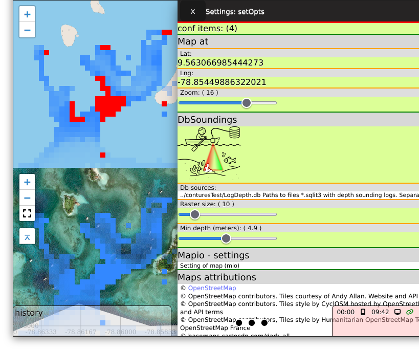
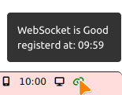
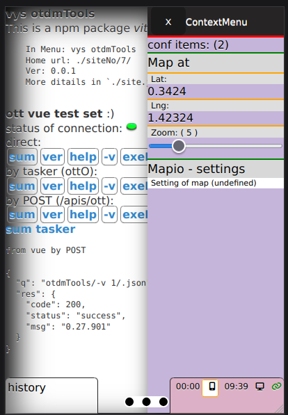
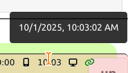

# viteyss-site-settings1

Settings, eggtry, ... global manager. To unify configuration / settings steps in your **site**'s.


By using it as it is you can skip steps of building forms, feadback calls on change of value in settings you want to give to user to set. 


### doing settings

You need to open 
```js
setOpts.methods.openPanelWithConfig( this.confT1 );
```
With config structure defined by you, rest is handled by viteyss-site-settings1.
examples of confT1 structure can be found in **viteyss-site-mapleaflet** / assets / mapioMapio.vue .  




Easy way to get uniform / vue like elements for values.

This can by starting point t build allso a ...


### doing eggTry icon

Nothing else then a icons next to your clock on a PC / laptop but in this case on **yss** . So we can call it build in system try.

Currently can:
- [x] clock / time
- [x] wemsocket connection status




- [ ] tests
    - [x] have background on click
    - [x] click can open config
    - [x] click can callback as config setting for eggTry

    


    - [x] react on value `watch` build in rgistration watch walue in `window`
    - [x] examples in project *.js files
    - [x] dynamic title's

    

Is started on init by line. in c_vys_settings1_Page.js
```js
eggTryOpts.methods.openPanelWithConfig( this.eTry );
```